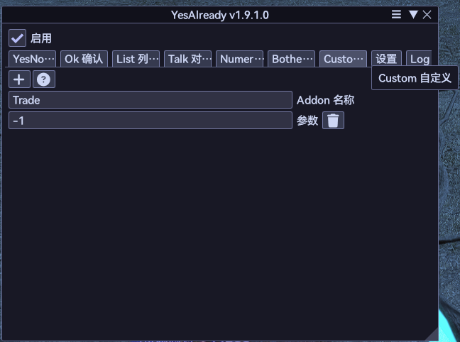
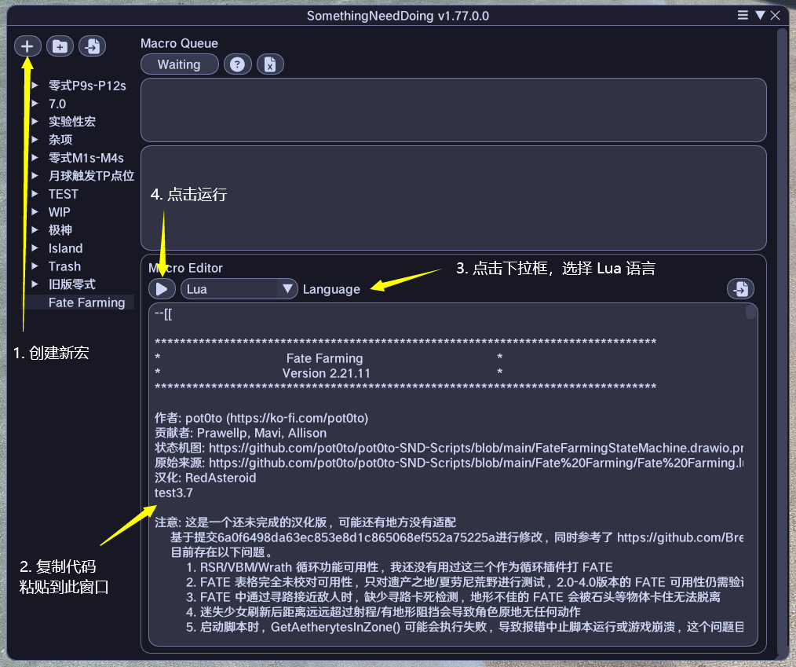
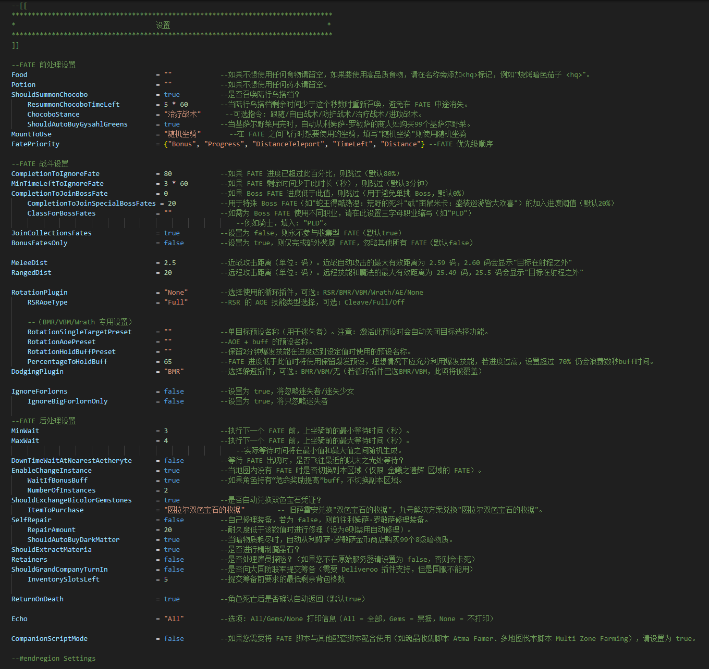
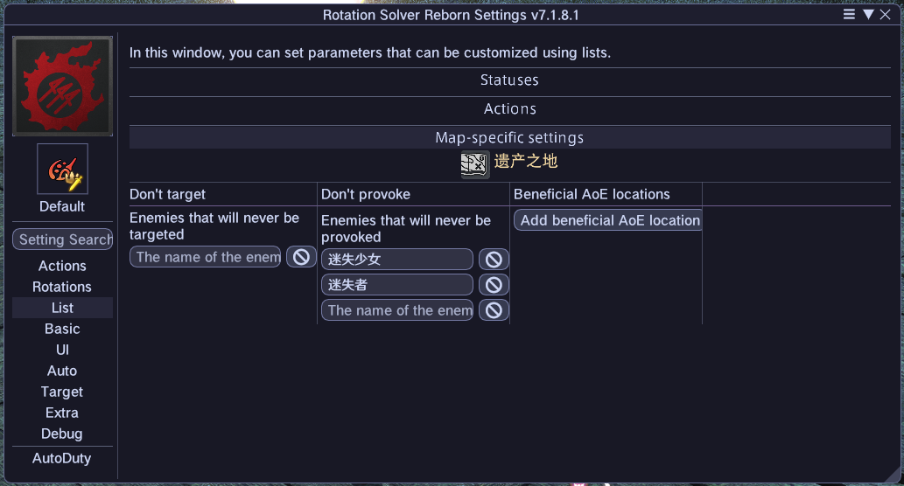
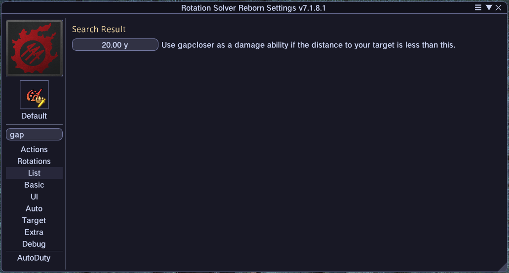

# Fate Farming CN
原作者库：https://github.com/pot0to/pot0to-SND-Scripts

适配中国服务器客户端使用

### Fate Farming 脚本具有以下功能：

- 在双色宝石接近上限时，自动兑换两种新旧版本的 **「双色宝石收据」**
- FATE 优先级系统: 额外奖励 > 最高进度 > 距离水晶最近的 FATE > 剩余时间 > 距离玩家最近的 FATE
- FATE 期间出现 **「迷失少女/迷失者」** 时进行优先处理
- 支持处理所有类型的 FATE，包括 NPC 收集物品 FATE
- 角色死亡后自动复活并返回 FATE 地图继续进行伐木
- 当前地图无可用 FATE 时自动尝试切换副本区域
- 可自动处理雇员任务和军队筹备，完成后返回 FATE 地图继续进行伐木
- 自动购买 **「基萨尔野菜」** 和 **「8级暗物质」** 在这些物品用完时
- 提供配套的 **「Atma farming」** 专用子脚本，也支持自定义脚本（参见 [配套脚本部分](#配套脚本)）

---

### 相较于原版有以下改动：
<details>
<summary><strong>点击展开</strong></summary>

- 新增支持 AEAssist 循环
- 修改 MinWait 和 MaxWait 默认值（3秒，4秒），以减少 FATE 完成后的等待时间
- 额外奖励 FATE 提升为最高优先级
- 修复 FlyBackToAetheryte 逻辑无法寻路到以太之光以及寻路到以太之光模型内部的问题
- 将 Retainers 默认设置为 false，防止不在原始服务器时卡死
- 改动 陆行鸟搭档 相关默认参数，以确保刷怪时血量相对健康
- SelectNextZone 逻辑添加更多防御性检测(没用)
- FATE 后处理任务添加延迟防止执行过快导致卡死
- 修复 自己修理装备时暗物质少于待修理装备导致卡死的问题，以及购买8级暗物质任务的错误逻辑顺序
- **大幅调整 MoveToFate 逻辑，现在会更加精准快速地抵达 FATE 位置**
- **大幅调整 DoFate 逻辑，选择目标与处理阻挡/距离异常逻辑将更加迅速**
- **调整 HandleUnexpectedCombat 的冷却周期，减少发呆时间**
- 允许 Bossmod / Bossmod Reborn 脱战时跟随在战斗逻辑中启用
- TeleportTo 逻辑增加空值/空字符串检查，新增逻辑用于脱离传送卡死，必须启用 Daily Routines 插件否则在检测到传送卡死后脚本将停止运行
</details>

---

### 一些其他注意事项：

- 中国服务器当前版本为`7.15`，卫月核心只支持`API 11`版本插件，国际服`API 12`插件无法正常安装，下方的相关插件请自行搜索**旧版本**或**本地化版本**进行安装。
- SelectNextZone 逻辑中使用的方法可能与其他插件发生冲突导致游戏崩溃，具体表现为使用多地图脚本伐木时，传送到不同的地图后重新运行 Fate Farming 脚本时游戏崩溃。**已知与 Daily Routines 插件本体冲突，如果您需要`多地图伐木`，请务必禁用此插件避免崩溃发生，如果仍有崩溃发生请自行排查异常插件。**
- 在中国服务器，大部分封号来自于小警察录屏即**玩家举报(bot hunter)**而非官方主动搜查，请务必小心它们，因此**不建议离机无人操作**。
- 禁止倒卖本仓库的任何内容，如果你从闲鱼购买了这个脚本，不要找我当客服，滚去找你亲爱的倒狗野爹。

---

### 安全性配置：

- **防止其他玩家交易(YesAlready)**
  <details>
  <summary><strong>点击展开</strong></summary>

   请按照图例在 `Custom` 版块填入 **Trade** 于 **`Addon 名称`**  
   参数为 **`-1`**

   此配置将**在发起或受到交易请求时自动关闭窗口**  
   **在您真正需要交易的时候别忘了禁用 YesAlready 或者删除它**

  

  </details>

---


### 额外插件需求：

**Daily Routines**: 

- 模块 `自动开始临危受命任务` 可以直接开始 NPC FATE，您可以移除掉一些因重名而注释或放入黑名单的 NPC FATE。  
- 模块 `自动取消交易` 可以拒绝其他玩家发起的交易，避免在战斗中被小警察交易导致输出中断。
- 目前已知 **启用此插件时**，动画锁内发起传送会导致当前地图无法再发起传送，因此脚本中添加了脱困逻辑，  
您需要模块 `自动进退副本一次`、`自动任务出发确认`，脚本会在错误触发时尝试加载它们并进行脱困。
- 这个错误一般会发生在 FATE 结束后脱战使用技能一类的功能，例如**画家脱战自动画画技能的动画锁期间正好发起了传送**。  
- 如果您**非常需要使用多地图伐木脚本**，请尽可能的禁用**含有脱战自动使用技能**的功能，并禁用 Daily Routines 插件防止崩溃。

**Repository 仓库:**
```
https://github.com/AtmoOmen/DalamudPlugins
```

**加入 Discord 获取更多信息:**  

```
https://discord.gg/dailyroutines
```

**注意！脚本只是使用了插件中的功能，与插件本身无关联，不建议在 Discord 过度讨论，如果被禁言或者被踢出频道责任自负。  
如有问题请优先在此仓库提交 issue。**

##  Something Need Doing 插件入门（SND）


## 安装依赖插件
### 必要插件
| 插件名称 | 用途 | 仓库 |
|-------------|---------|------|
| Something Need Doing [Expanded Edition] | 运行代码的主插件 | https://puni.sh/api/repository/croizat |
| VNavmesh | 寻路与移动 | https://puni.sh/api/repository/veyn |
| RotationSolver Reborn <b>或</b> BossMod Reborn <b>或</b> Veyn's BossMod <b>或</b> Wrath Combo | 选择目标并攻击敌人 | https://raw.githubusercontent.com/FFXIV-CombatReborn/CombatRebornRepo/main/pluginmaster.json<br>https://raw.githubusercontent.com/FFXIV-CombatReborn/CombatRebornRepo/main/pluginmaster.json<br>https://puni.sh/api/repository/veyn<br>https://love.puni.sh/ment.json |
| TextAdvance | 与 FATE NPC 进行交互 | https://github.com/NightmareXIV/MyDalamudPlugins/raw/main/pluginmaster.json |
| Teleporter | 传送到以太之光 | Dalamud 主库 |
| Lifestream | 切换副本区域 | https://raw.githubusercontent.com/NightmareXIV/MyDalamudPlugins/main/pluginmaster.json |

### 可选插件
| 插件名称 | 用途 | 仓库 |
|-------------|---------|------|
| BossMod Reborn <b>或</b> Veyn's BossMod | AI 功能用于躲避机制 | https://raw.githubusercontent.com/FFXIV-CombatReborn/CombatRebornRepo/main/pluginmaster.json<br>https://puni.sh/api/repository/veyn |
| AutoRetainer | 在雇员就绪时处理雇员任务，然后返回 FATE 地图继续伐木 | https://love.puni.sh/ment.json |
| Deliveroo | 在您的雇员带回太多物品堵塞物品栏时，向大国防联军提交装备 | https://plugins.carvel.li/ |
| Daily Routines | 处理在动画锁中发起传送导致卡死 | https://raw.githubusercontent.com/AtmoOmen/DalamudPlugins/main/pluginmaster.json |

## 设置
### 脚本设置
脚本包含多项可调整参数用于精细化调整双色宝石收益。此部分内容持续更新，建议您在每次更新脚本后重新查阅！


### RSR 设置
| | |
|--|--|
|  | 无论您的职业是否为 Tank，都选择 "All Targets that are in range for any abilities (Tanks/Autoduty)" |
|  | 将 **「迷失少女」** 和 **「迷失者」** 添加到 Prio Target 中 |
|  | 推荐近战设置：gapcloser distance = 20y |

## 配套脚本
配套脚本需与基础脚本 `Fate Farming.lua` 配合使用，可针对不同 FATE 伐木场景提供更精细的控制。


以 `Atma Farming.lua` 脚本为例：


1. 将 `Atma Farming.lua` 和 `Fate Farming.lua` 同时设置为SND中的宏命令。
2. 确保 `Fate Farming.lua` 中的参数满足：`CompanionScriptMode` 设置为 `true`。
   可选：可同时关闭 `WaitIfBonusBuff` 功能。
3. 确认 `Atma Farming.lua` 中的 `FateMacro` 参数值需与您命名的 FATE 宏完全一致。
4. 启动 `Atma Farming.lua` 脚本。

## FAQ 常见问题解答
### 最佳的 FATE 伐木地图在哪里？
根据您所在的的服务器人口与地图人数决定。人数越多，FATE 怪物血量越高，
但同时完成速度也越快，热门地图推荐：
- 遗产之地：FATE 等级低到既可以快速击杀怪物，同时又高到不需要等级同步
- 克扎玛乌卡湿地：以太之光位置覆盖范围良好，没有像遗产之地那样的高墙
- 夏劳尼荒野：如果您不介意专心照看角色并且对特殊 FATE (蛇王得酷热涅：荒野的死斗 > `美花帕拉` 坐骑)或 S 级狩猎怪物感兴趣，
可以选择这张地图，不过两者都需要手动干预。
由于特殊 FATE 和 S 级狩猎怪物的存在，这个地图通常有很多人。
情况好坏取决于：这些人是在和你一起刷 FATE 还是只是在挂机。
- 汉化者建议：最佳地图为遗产之地、夏劳尼荒野，6.0 版本建议厄尔庇斯，5.0 版本不建议任何地图。

### 使用什么职业最好？
取决于你拥有的职业，但热门选择是：
- 你拥有最佳装备(BiS)的任何职业
- **`战士`** 生存能力强且有突进技能。非常适合单刷，因为您可以拉所有怪
- **`白魔法师`** 的神圣连发可以击晕敌人。如果你能在神圣发动前承受住初始攻击，可能比 **`战士`** 完成 FATE 更快
- **`蝰蛇剑士`** 伤害很高，但生存可能是个问题，将你的陆行鸟设为治疗战术
- **`绘灵法师`**(最佳) 同样伤害很高，但 FATE 脚本可能会经常让你离开绘灵幻景区域
- 汉化者建议：无脑绘灵法师，陆行鸟搭档选治疗战术保活。治疗坦克输出不够，而近战在输出环境上会丢失大量伤害影响效率，因此选画家，实战也是最佳的。

### 为什么我的游戏会卡顿？特别是在进行 BOSS FATE 时？
您安装了 Pandora's Box 吗？尝试完全关闭它。
### 为什么粘贴到 SND 后无法编辑脚本？
尝试先粘贴到记事本，在那里编辑，然后使用 SND 中的 "从剪贴板导入" 按钮粘贴进去。


## Discord
**请不要在频道里询问此汉化版本的任何问题，脚本只适配于中国服务器的客户端且有部分代码改动，如有问题请在此仓库提交 issue！**

**Please do not ask any questions about this localized version in the channel. The script is only adapted for the Chinese server client with some code modifications. If you encounter any issues, please submit them as issues in this repository!**

https://discord.gg/punishxiv > ffxiv-snd (channel) > pot0to's fate script (thread)
